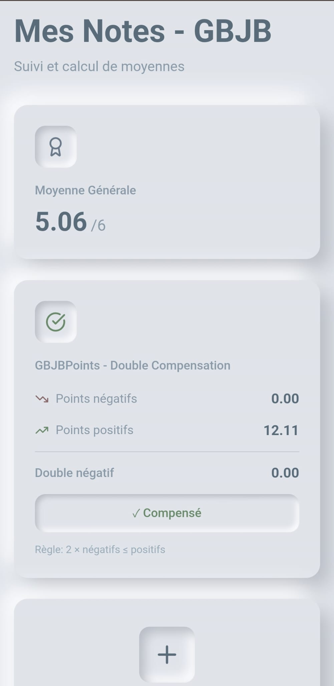

Bonjour !

Si vous cherchez une application afin de noter vos résulats scolaires, vous êtes au bon endroit ! 
Découvrez NotesGym ! 

**Features :**
- Noter les résultats
- Calcul de moyenne par matière
- Calcul de moyenne générale
- Création d'un graphique à partir des notes pour chaque matière
- Possibilité d'exclure une note du bulletin (de la moyenne générale)

Pour toute suggestion : helver@duck.com
